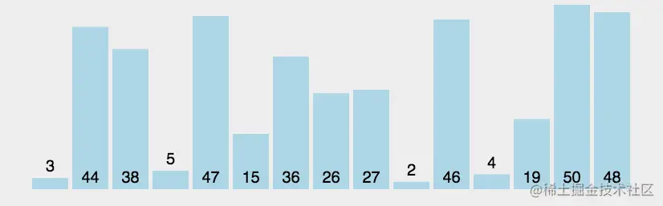

### 冒泡排序

数组内相邻两位数比较，不满足大小关系互换位置

时间复杂度：O(n^2)

```javascript
function bubbSort(arr) {
  const len = arr.length
  // len-1,数组最后一位没有可比数据，不需要比
  for (let i = 0; i < len-1; i++) {
    let flag = false // 判断是否有变化，无变化直接跳出此次循环
    for (let j = 0; j < len-1-i; j++) { // i增加一，会排好最后一位
      if(arr[j]>arr[j+1]) { // 比较当前位置数据和下一位的大小关系
        const temp = arr[j]
        arr[j] = arr[j+1]
        arr[j+1] = temp
        flag = true
      }
    }
    if (!flag) break // 如果没有改变flag，说明冒泡已经完成了，不需要继续冒泡了
  }
  return arr
}
const arr = [3,1,56,7,8,90,234,54,6,88,234]
console.log(bubbSort(arr))
```



### 插入排序

构造有序序列，从后向前扫描有序序列，将未排序数据插入到相应位置中

步骤：
1.从第一个元素开始，该元素可以认为已经被排序；
2.取出下一个元素，在已经排序的元素序列中从后向前扫描；
3.如果该元素（已排序）大于新元素，将该元素移到下一位置；
4.重复步骤 3，直到找到已排序的元素小于或者等于新元素的位置；
5.将新元素插入到该位置后；
6.重复步骤 2 ~ 5。

时间复杂度：O(n^2)

```javascript
function insertSort(arr) {
  const len = arr.length
  let preIndex, current
  for (let i = 1; i < len; i++) {
    preIndex = i - 1; // 初始化扫描指针(默认数组第一位)
    current = arr[i] // 当前值
    while (preIndex >= 0 && arr[preIndex] > current) {
      arr[preIndex + 1] = arr[preIndex]
      preIndex--
    }
    if (preIndex + 1 != i) {
      arr[preIndex + 1] = current
    }
  }
  return arr
}

const arr = [3,1,56,7,8,90,234,54,6,88,234]
console.log(insertSort(arr))
```

### 选择排序

步骤：
1.首先在未排序序列中找到最小（大）元素，存放到排序序列的起始位置。
2.再从剩余未排序元素中继续寻找最小（大）元素，然后放到已排序序列的末尾。
3.重复第二步，直到所有元素均排序完毕。

时间复杂度：O(n^2)。

```javascript
function selectSort(arr) {
  const len = arr.length
  let minIndex, temp;
  for (let i = 0; i < len - 1; i++) {
    minIndex = i
    for (let j = i + 1; j < len; j++) {
      if (arr[j] < arr[minIndex]) {
        minIndex = j
      }
    }
    temp = arr[i];
    arr[i] = arr[minIndex];
    arr[minIndex] = temp;
  }
  return arr
}
```

### 快速排序

快速排序的特点就是快，而且效率高！它是处理大数据最快的排序算法之一。

1.先找到一个基准点（一般指数组的中部），然后数组被该基准点分为两部分，依次与该基准点数据比较，如果比它小，放左边；反之，放右边。
2.左右分别用一个空数组去存储比较后的数据。
3.最后递归执行上述操作，直到数组长度 <= 1;

特点：快速，常用。
缺点：需要另外声明两个数组，浪费了内存空间资源

时间复杂度：O(n log n)

```javascript
// 快速排序
const quickSort = (arr, left, right) => {
 let len = arr.length,
  partitionIndex;
 left = typeof left != 'number' ? 0 : left;
 right = typeof right != 'number' ? len - 1 : right;

 if (left < right) {
  partitionIndex = partition(arr, left, right);
  quickSort(arr, left, partitionIndex - 1);
  quickSort(arr, partitionIndex + 1, right);
 }
 return arr;
};

const partition = (arr, left, right) => {
 //分区操作
 let pivot = left, //设定基准值（pivot）
  index = pivot + 1;
 for (let i = index; i <= right; i++) {
  if (arr[i] < arr[pivot]) {
   swap(arr, i, index);
   index++;
  }
 }
 swap(arr, pivot, index - 1);
 return index - 1;
};

const swap = (arr, i, j) => {
 let temp = arr[i];
 arr[i] = arr[j];
 arr[j] = temp;
};
```

### 希尔排序（Shell Sort）

1.先将整个待排序的记录序列分割成为若干子序列。
2.分别进行直接插入排序。
3.待整个序列中的记录基本有序时，再对全体记录进行依次直接插入排序。

```javascript
const shellSort = arr => {
 let len = arr.length,
  temp,
  gap = 1;
 console.time('希尔排序耗时');
 while (gap < len / 3) {
  //动态定义间隔序列
  gap = gap * 3 + 1;
 }
 for (gap; gap > 0; gap = Math.floor(gap / 3)) {
  for (let i = gap; i < len; i++) {
   temp = arr[i];
   let j = i - gap;
   for (; j >= 0 && arr[j] > temp; j -= gap) {
    arr[j + gap] = arr[j];
   }
   arr[j + gap] = temp;
   console.log('arr  :', arr);
  }
 }
 console.timeEnd('希尔排序耗时');
 return arr;
};
```

### 归并排序

将一个数组分成两部分分别排序，在合并在一起排序

时间复杂度：O(n log n)

```javascript
const mergeSort = arr => {
 //采用自上而下的递归方法
 const len = arr.length;
 if (len < 2) {
  return arr;
 }
 // length >> 1 和 Math.floor(len / 2) 等价
 let middle = Math.floor(len / 2),
  left = arr.slice(0, middle),
  right = arr.slice(middle); // 拆分为两个子数组
 return merge(mergeSort(left), mergeSort(right));
};

const merge = (left, right) => {
 const result = [];

 while (left.length && right.length) {
  // 注意: 判断的条件是小于或等于，如果只是小于，那么排序将不稳定.
  if (left[0] <= right[0]) {
   result.push(left.shift());
  } else {
   result.push(right.shift());
  }
 }

 while (left.length) result.push(left.shift());

 while (right.length) result.push(right.shift());

 return result;
};
```

参考文章：https://juejin.cn/post/6844903902484103182
